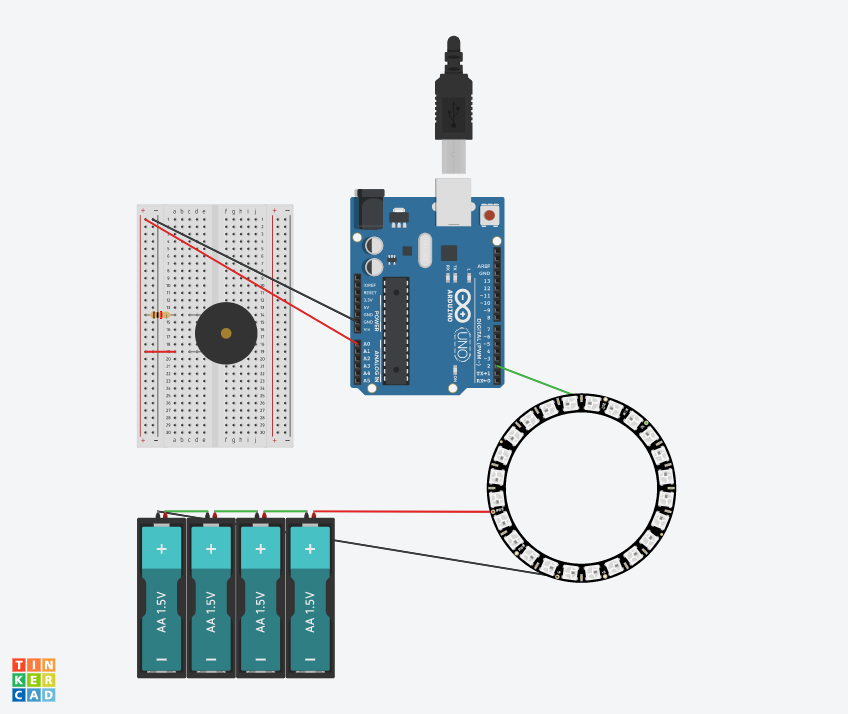

# Final Project - Physical Computing and the Internet of Things

*Name:*  <Trash Data Blackhole>  

*Date:* <Dec.14 2017>

## Project:  < Trash Data Blackhole>

< This installation is a designed to response to trash data created about certain museum, gallery or exhibition.>
< The blackhole will symbolize suck those trash data in and make it vainish with Led light effect.>
< In order to make people realized the exsistence of trash data around them.>

### Detailed Project Description

< This is a installation designed for set up in exhibition space in Museum/Gallery/Salon.
  It could be hang on the gallery wall, response to noise create by the people in the physical space and social media data about the exhibition with LED light effect.
  The idea of this installation comes from my personal experience of visiting exhibitions and explorer my social network about that.
  I think museum or gallery should be a space for people enjoy art works, so it should be a quiet space. But during most of my exhibiton visit, other people's talk, cellphone ringtone, even children playing distracted me a lot. 
  Also, as arts became popular to public, going to an art exhibition became a trend. Everyone who had been to a art show definately took some pictures, but for people who want to show off, they also post pictures on their social media like instagram, facebook, twitter, etc.Those posts create a lot of data crowded our view and space of virtual world like virus.
  My Trash Data Blackhole's form is based on infinite mirror, a mirror and a arcylic sheet set parrallel to each other, led strip mounted inbetween. When leds light up, light will bounce back and forth between mirror and acrylic sheet, create a infinite space effect.
  For me, either the data or the noise is trash information to me, I want to make people realize those trash datas. Everytime this installation received data, it will trigger led strip set inside, led strip will light up then fade, as if the data is sucked in and disappear in it just like a blackhole.
  
### Technical Description

< The mechanism of Trash Data Blackhole is pretty simple. A piezo connected to photon redboard as a sound sensor, and a addressable led strip also connected to redboard. The led strip need power with 4x 1.5 AA batteries, also triggered with IFTTT notification.
When piezo get sound, it will send signal to led strip and light it up, then send a message to consule "Noisy!" 
Similar to sound sensor, everytime someone post on social media with specific hashtag, IFTTT will sent notice text "oops" to photon redboard, the LED also lights up and fade, then send a message "Trash!"  >

#### Hardware Wiring Diagram

<Powered with 4 1.5V batteries, Led strip get data from pin D2>
<Piezo as shock sensor conected to pin A0>

#### Code

< 
#include <SparkButton.h> // include library
#include "Particle.h"
#include "neopixel.h"
SparkButton b = SparkButton();
SYSTEM_MODE(AUTOMATIC);

#define PIXEL_PIN D2 // set pin and led
#define PIXEL_COUNT 59
#define PIXEL_TYPE WS2812B

Adafruit_NeoPixel strip(PIXEL_COUNT, PIXEL_PIN, PIXEL_TYPE);

int ledPin = D2;
int knockSensor = 0;               
byte val = 0;
int statePin = LOW;
int THRESHOLD = 50;

String lightSignal;

// setup 
void setup() {
  strip.begin();
  strip.show(); 
  pinMode(ledPin, OUTPUT); 
  Serial.begin(9600);
  Spark.function("twitter",twitter); //function for twitter notification
  b.begin();
}

// read sensor's signal and response with led
void loop() {
    val = analogRead(knockSensor);     
  if (val >= THRESHOLD) {
    colorWipe(strip.Color(255, 255, 255), 150); 
    colorWipe(strip.Color(0, 0, 0), 150); 
    Serial.println("NOISY!");
  }
         delay(1000);
  }

  // read twitter's notification and response with led
  int twitter(String args){
    colorWipe(strip.Color(255, 255, 255), 150); 
    colorWipe(strip.Color(0, 0, 0), 150); 
    Serial.println("TRASH!");
  }
      
// set led style
void colorWipe(uint32_t color, uint8_t wait) {
  for(uint16_t i=0; i<strip.numPixels(); i++) {
      strip.setPixelColor(i, color);
      strip.show();
      delay(10);
  }
}>

### Design / Form

<In order to fit in the environment of art gallery, I try to keep its shape simple and clean. So the Trash Data Blackhole is designed in round shape infinate mirror.The shell's diameter is 34 cm, and height of 8 cm. The thickness meets the need of space at the back of shell to hold sensor, photon redboard, and wires, so I made a lid to cover that space.
To make the body of blackhole perfect, I try to use 3D printing to make it, both the lid and shell are sliced into 4 piece to meed the size of 3D printer Uiltimaker. After printed out, I polished all the surface and glue them together. Then paint it with black matte paint, just to make it looks mysterious.

### Evaluation / Reflection

<  The coding and design of my project is simple, but I feel it would be useful for art exhibitons and would remind people with how many data they creates. The project somehow is not sophisticated，there is a lot of room to be improved, like deeper criticize about trash data, better coding build. 
Working on this project, I learned so many thing about 3D printing including better slice setting, layout setting, opearation and preparation of 3D printer. 
If I have more time, I will improve the craft of the body of installation, and maybe add more sensor to project.>
